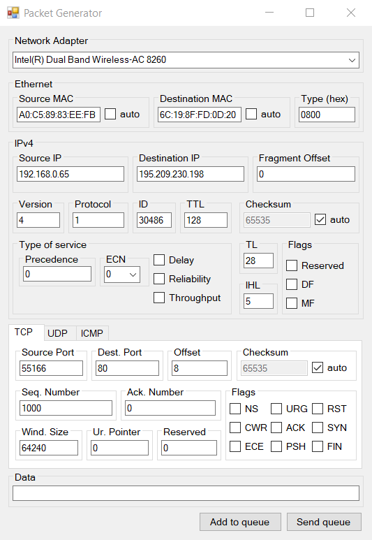

# PacketGenerator

It uses Windows Forms (Microsoft .NET Framework) for GUI and PCAP for the interaction between program and network adapter. I used this link https://www.youtube.com/watch?v=YpnrR7D_lRI to configure the library for Visual Studio.

The software package generation module allows you to perform the following actions: 
1. allows the user to create any package in the part of filling in all fields of protocols (including those reserved); 
2. automatic detection of the present network interfaces and the possibility for the user to select the desired interface; 
3. automatic generation of information packet level (Ethernet 802.3) - the MAC address of the sender and the MAC address of the recipient at the specified ip-addresses; 
4. the ability to enter incorrect data in the protocol fields (length, checksum, etc.); 
5. generate sequences of generated network packets and send data packets on a user-selected interface. 

Below is the interface of the developed program.

